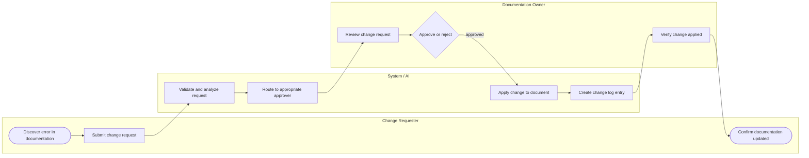
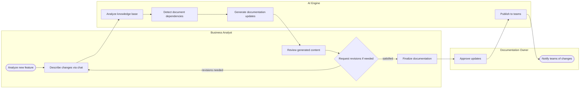
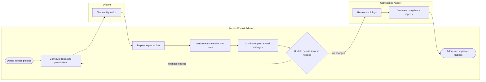
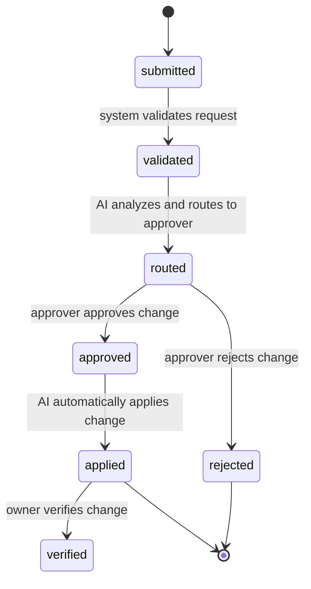
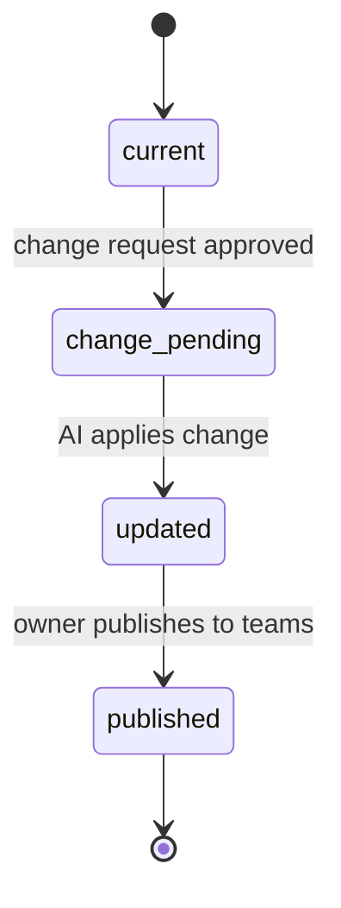
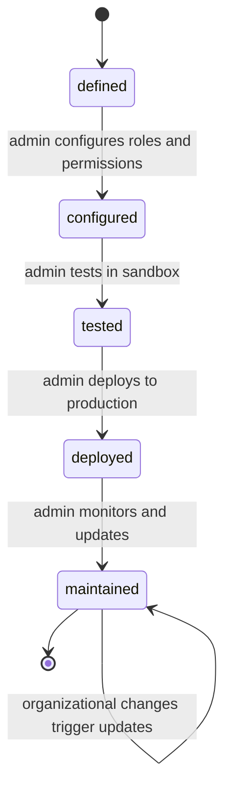

# Business Specification: 9To5ive New — Knowledge Base Management & Documentation Coherence Platform

## Overview

Knowledge regarding our software project is often distributed across multiple sources and the entire body of knowledge is spread across multiple documents. Each document might also be quite long. When a new enhancement needs to be made to the software project, it is difficult to ensure that new updates are coherent with the existing document. It is also hard to track changes to the document during review. There is also difficulty knowing which existing documents might need to be updated depending on the type of enhancement.

# Business Specification: 9To5ive New — Knowledge Base Management & Documentation Coherence Platform

## Executive Summary
9To5ive New is a centralized Knowledge Base Management and Documentation Coherence Platform designed to solve the critical problem of distributed, inconsistent, and difficult-to-maintain project documentation. The platform consolidates application knowledge across multiple sources, provides AI-driven dependency detection to identify which documents must be updated when features change, and implements a governed change workflow with immutable audit trails. The system enables four primary user personas—Documentation Owners (Sarah Chen), Access Control Administrators (Jennifer Park), Business Analysts (Alex Thompson), and Change Requesters (Marcus Rodriguez)—to collaborate on keeping documentation accurate, current, and trustworthy. The platform uses conversational AI interfaces for change description, automated routing based on role-based access control, and comprehensive change logging to ensure every modification is traceable and reversible. By consolidating knowledge, automating dependency detection, and enforcing governance, 9To5ive New reduces the risk of operational errors caused by stale documentation, accelerates the time-to-update for feature changes, and maintains compliance through auditable change trails.

## Scope Definition
### In Scope

**Core Platform Capabilities:**
- Centralized Knowledge Portal: A single interface where all project documentation (playbooks, runbooks, business requirement documents, process guides) is stored, searchable, and accessible.
- Documentation Change Request Workflow: A governed process where team members submit change requests, the system routes them to appropriate approvers based on access control rules, and approved changes are automatically applied.
- AI-Driven Dependency Detection: When a feature is added or a document is updated, the AI analyzes the Knowledge Base to identify all related documents that may have dependencies and require updates.
- Conversational Change Interface: Business Analysts can describe documentation changes in natural language through a chat interface, and the AI generates proposed updates for review and iteration.
- Change Log & Audit Trail: Every change is immutably recorded with timestamp, author, rationale, and before/after state, enabling full traceability and compliance.
- Role-Based Access Control (RBAC): Configurable permissions govern who can request changes, approve changes, and administer the system.
- Change Approval Routing: Requests are automatically routed to designated approvers based on document ownership, change type, and organizational hierarchy.
- Document Versioning: The system maintains version history, allowing rollback if needed, and tracks which version is current.
- Notification & Status Tracking: Requesters and approvers receive real-time notifications of change status, and a dashboard provides visibility into pending and completed changes.
- Integration with Existing Documentation Sources: The system can ingest documentation from multiple sources (wikis, shared drives, document management systems) and consolidate them into a single Knowledge Base.

**Supported Document Types:**
- Playbooks (step-by-step process guides)
- Runbooks (operational procedures)
- Business Requirement Documents (BRDs)
- Process guides and standard operating procedures (SOPs)
- Architecture and design documentation
- API documentation and integration guides

**Governance & Compliance:**
- Immutable audit trail of all changes
- Compliance reporting and anomaly detection
- Access control policy management
- Periodic access reviews and permission updates

### Out of Scope

**Not Included in This Release:**
- Real-time collaborative editing (Google Docs-style simultaneous editing)
- Integration with external LLM providers for content generation (AI processing is internal)
- Automatic translation of documentation into multiple languages
- Advanced analytics on documentation usage patterns (basic metrics only)
- Integration with external project management tools (Jira, Azure DevOps) beyond read-only data import
- Mobile app (web-only in initial release)
- Workflow automation beyond change approval routing (e.g., automated testing of documented procedures)
- Document templates and guided authoring (basic templates only)
- Integration with external identity providers (LDAP, Active Directory) in initial release

**Explicitly Excluded:**
- The system does NOT become the system of record for operational data; it is a knowledge repository only.
- The system does NOT automatically execute changes to production systems; it only updates documentation.
- The system does NOT replace existing document management systems; it consolidates and provides a unified interface.
- The system does NOT provide real-time collaboration on document editing; changes go through the formal workflow.

### Boundaries

**System Boundaries:**
- The Knowledge Portal is the primary interface; integrations with external systems are read-only (ingest) or notification-only (outbound).
- The AI engine is internal to the platform; no external LLM calls or provider dependencies.
- Change approval is the final gate; once approved, changes are automatically applied to the Knowledge Base.
- The audit trail is immutable and cannot be modified or deleted by any user role.

**Organizational Boundaries:**
- Access control is configured per organization/team; multi-tenancy is supported at the organizational level.
- Change approval workflows can be customized per organization but follow the same core pattern (request → route → approve → apply → log).
- Compliance requirements are configurable per organization (e.g., audit retention policies).

## Actor Definitions
### 1. Sarah Chen — Documentation Owner / Knowledge Steward

**Role & Responsibility:**
Sarah is responsible for maintaining the accuracy, consistency, and currency of the Knowledge Base. She reviews change requests, approves or rejects them based on correctness and alignment with current processes, and ensures that documentation reflects the actual state of operations.

**Key Responsibilities:**
- Identify outdated or incorrect documentation in playbooks and runbooks
- Submit change requests with clear rationale and scope
- Review and approve documentation updates from other team members
- Monitor the change log to verify updates were applied correctly
- Periodically audit the Knowledge Base for consistency and accuracy
- Ensure all teams are using the current version of documents
- Escalate or reject changes that are incorrect or incomplete

**Permissions & Authority:**
- Can submit change requests
- Can approve change requests (for documents she owns or is designated approver for)
- Can view the full change log and audit trail
- Can view all documents in the Knowledge Base
- Can configure document ownership and approval rules (if admin)
- Cannot delete or permanently remove change log entries

**Pain Points:**
- Documentation scattered across multiple systems with no single source of truth
- Manual update processes are slow, error-prone, and difficult to track
- No visibility into who made changes, when, or why
- Difficulty ensuring all teams are using the same current version
- Risk of stale or conflicting information causing operational errors

**Success Metrics:**
- Time to identify and correct documentation errors (target: < 1 day)
- Percentage of change requests approved within SLA (target: 95%)
- Documentation accuracy score (target: > 95% of documents current and correct)
- Change log completeness (100% of changes tracked)

---

### 2. Jennifer Park — Access Control Administrator / Governance Lead

**Role & Responsibility:**
Jennifer manages the governance layer of the documentation system, configuring access control policies, assigning permissions, maintaining audit compliance, and ensuring that only authorized people can request and approve changes.

**Key Responsibilities:**
- Define access control policies for different roles and teams
- Assign roles and permissions to team members
- Configure approval workflows and escalation rules
- Review audit logs and change history for compliance
- Investigate anomalies or policy violations
- Adjust permissions based on organizational changes
- Ensure compliance with regulatory requirements
- Generate compliance reports for auditors or regulators

**Permissions & Authority:**
- Can configure access control policies and roles
- Can assign and revoke permissions for all users
- Can view the full audit trail and compliance reports
- Can configure approval workflows and escalation rules
- Can view all documents and change requests
- Can generate compliance reports
- Can set audit retention policies
- Cannot approve or reject individual change requests (unless also assigned as approver)
- Cannot modify or delete audit log entries

**Pain Points:**
- Difficulty defining granular access control rules for different teams
- No clear visibility into who has what permissions
- Manual management of access control is error-prone and time-consuming
- Audit logs may not capture sufficient detail for compliance
- Difficulty revoking access when team members change roles or leave
- Unclear approval chain for different types of documentation changes

**Success Metrics:**
- Time to configure new access control policies (target: < 2 hours)
- Percentage of access control violations detected and remediated (target: 100%)
- Audit trail completeness (100% of changes logged)
- Compliance report generation time (target: < 1 hour)
- Access revocation time for departing employees (target: < 1 day)

---

### 3. Alex Thompson — Business Analyst / Documentation Change Manager

**Role & Responsibility:**
Alex drives strategic documentation updates when new features are introduced or major processes change. She uses conversational AI to describe changes, leverages AI-driven dependency detection to identify all affected documents, and coordinates multi-document updates to ensure consistency.

**Key Responsibilities:**
- Identify documentation changes needed due to feature additions or process changes
- Describe required changes through conversational chat interface
- Review AI-generated documentation updates
- Iterate on changes until satisfied with quality and accuracy
- Validate that all dependent documents are being updated consistently
- Route finalized changes to appropriate approvers
- Monitor approval status and escalate if needed
- Ensure all related documents are synchronized after approval

**Permissions & Authority:**
- Can submit change requests
- Can access the chat interface for conversational change description
- Can view AI-generated documentation proposals
- Can request revisions and iterate on AI-generated content
- Can view the dependency map and related documents
- Can view the change log for documents she has worked on
- Can approve change requests (if designated as approver)
- Cannot configure access control or system policies

**Pain Points:**
- Traditional change request forms are time-consuming and rigid
- Manual documentation updates are error-prone and tedious
- Difficult to iterate quickly on documentation changes
- No easy way to describe complex feature changes
- Approval process delays getting updated documentation to teams
- Difficult to identify all affected documents when a feature changes
- Feature specifications may be unclear or incomplete
- No clear mapping between features and documentation

**Success Metrics:**
- Time to describe and generate documentation changes (target: < 30 minutes)
- Percentage of AI-identified dependencies that are correct (target: > 90%)
- Number of iterations needed to finalize changes (target: < 3)
- Time from change submission to approval (target: < 1 day)
- Consistency score across dependent documents (target: > 95%)

---

### 4. Marcus Rodriguez — Change Requester / Team Member / Process Contributor

**Role & Responsibility:**
Marcus is a frontline team member who encounters documentation gaps or errors while executing processes. He submits change requests to report discrepancies and contribute to improving the Knowledge Base.

**Key Responsibilities:**
- Execute documented playbooks and runbooks
- Identify discrepancies between documentation and actual processes
- Submit change requests to report errors or gaps
- Provide clear rationale and context for requested changes
- Wait for approval and confirmation that changes were applied
- Verify that updated documentation is correct
- Provide feedback on documentation clarity and accuracy

**Permissions & Authority:**
- Can submit change requests
- Can view the documents they are working with
- Can view the status of their own change requests
- Can view the change log for documents they have submitted changes for
- Cannot approve change requests
- Cannot configure access control or system policies
- Cannot view other users' change requests (unless shared)

**Pain Points:**
- Unclear how to report documentation errors or suggest improvements
- No visibility into whether a change request was received or acted upon
- Uncertainty about who has authority to approve changes
- Delays in getting documentation corrected
- Fear that feedback will be ignored or lost
- No confirmation that the request was submitted successfully
- Unclear timeline for approval or implementation

**Success Metrics:**
- Time to submit a change request (target: < 5 minutes)
- Percentage of change requests that receive acknowledgment (target: 100%)
- Time from submission to approval/rejection (target: < 2 days)
- Percentage of approved changes that are applied correctly (target: > 98%)
- User satisfaction with change request process (target: > 4/5)

---

### 5. System Administrator (Implicit)

**Role & Responsibility:**
Manages the overall platform, including system configuration, user management, backup/recovery, and technical operations.

**Key Responsibilities:**
- Configure system settings and integrations
- Manage user accounts and organizational structure
- Monitor system health and performance
- Perform backups and disaster recovery
- Manage integrations with external documentation sources
- Configure notification channels and templates
- Monitor and troubleshoot system issues

**Permissions & Authority:**
- Full system access
- Can configure all system settings
- Can manage all users and roles
- Can view all audit logs and reports
- Can perform system maintenance and backups
- Can configure integrations

---

### Actor Interaction Matrix

| Interaction | Sarah (Owner) | Jennifer (Admin) | Alex (Analyst) | Marcus (Requester) |
|---|---|---|---|---|
| **Submit Change Request** | ✓ | ✓ | ✓ | ✓ |
| **Approve Change Request** | ✓ | ✗ | ✓ (if designated) | ✗ |
| **View Change Log** | ✓ | ✓ | ✓ | ✓ (own requests) |
| **Configure Access Control** | ✗ | ✓ | ✗ | ✗ |
| **View Audit Trail** | ✓ | ✓ | ✓ (own work) | ✗ |
| **Use Chat Interface** | ✗ | ✗ | ✓ | ✗ |
| **View Dependency Map** | ✓ | ✓ | ✓ | ✗ |
| **Generate Compliance Reports** | ✗ | ✓ | ✗ | ✗ |

## User Journey Flows
## Journey 1: Documentation Update and Approval Workflow with Change Log

**Actor:** Sarah Chen (Documentation Owner)  
**Scenario:** Sarah discovers that a critical playbook contains outdated process steps. She needs to submit a change request, track its approval, and verify the update was applied correctly.

### Stage 1: Discovery & Assessment
**Actions:**
- Reviews current playbook or runbook
- Identifies inaccuracies or outdated information
- Determines scope and impact of required changes

**System Support:**
- Provide a centralized view of all documents needing updates
- Flag documents that haven't been reviewed recently
- Show document usage metrics and last-modified dates

**Outcome:** Sarah has identified the specific sections that need updating and understands the scope of changes.

---

### Stage 2: Change Request Submission
**Actions:**
- Accesses the centralized documentation interface
- Selects the document to be updated
- Specifies the required changes with clear rationale
- Submits the change request

**System Support:**
- Provide templates or guided workflows for common change types
- Offer real-time validation and feedback on the change request
- Auto-populate fields based on document context
- Show confirmation that the request was received

**Outcome:** Change request is submitted with clear description and rationale.

---

### Stage 3: AI Processing & Approval Routing with Change Log
**Actions:**
- System receives and validates the change request
- AI analyzes the requested changes for feasibility and consistency
- System routes the request to appropriate approvers based on access control rules
- Approvers review and approve or reject the change
- System prepares change log entry with timestamp, author, and rationale

**System Support:**
- Provide real-time status updates on change requests
- Suggest approvers based on document ownership and expertise
- Set escalation rules for stalled approvals
- Pre-populate change log with request details

**Outcome:** Change request is routed to the correct approver and is either approved or rejected with feedback.

---

### Stage 4: Automated Application & Verification
**Actions:**
- Once approved, AI automatically applies the change to the document
- System creates a change log entry with timestamp, author, and rationale
- Documentation owner receives confirmation of applied change
- Owner verifies the change was applied correctly

**System Support:**
- Provide side-by-side diff view of changes
- Make change log searchable and filterable by date, author, document
- Allow rollback of changes if needed
- Send notifications to all teams using the updated document

**Outcome:** Change is applied, logged, and verified. Teams are notified of the update.

---

### Stage 5: Knowledge Base Maintenance & Audit
**Actions:**
- Documentation owner periodically reviews change log
- Monitors document accuracy and consistency across teams
- Identifies patterns in change requests to improve processes
- Ensures access control rules are still appropriate

**System Support:**
- Provide analytics dashboard showing change frequency, approvers, and document health
- Highlight documents with high change volume or frequent reversions
- Suggest documentation improvements based on change patterns
- Alert when access control rules may need updating

**Outcome:** Knowledge Base remains current, consistent, and trustworthy.

---

## Journey 2: Configuring and Managing Documentation Access Control

**Actor:** Jennifer Park (Access Control Administrator)  
**Scenario:** Jennifer needs to set up access control rules for a new documentation system, ensuring that team leads can approve changes for their domain while individual contributors can submit requests but not approve.

### Stage 1: Requirements & Policy Definition
**Actions:**
- Gathers requirements from stakeholders about who should have access
- Defines roles and permission levels (e.g., requester, approver, admin)
- Determines approval chains for different types of changes
- Identifies compliance and audit requirements

**System Support:**
- Provide templates for common access control policies
- Create a policy wizard to guide policy definition
- Offer pre-built role definitions for common organizational structures
- Include compliance checklist for regulatory requirements

**Outcome:** Access control policy is defined and documented.

---

### Stage 2: Access Control Configuration
**Actions:**
- Accesses the access control management interface
- Defines roles with specific permissions (request, approve, admin)
- Creates approval workflows for different document types or teams
- Assigns team members to roles
- Tests the access control configuration

**System Support:**
- Provide a visual workflow builder for approval chains
- Allow bulk import of roles and permissions from CSV or directory
- Offer a sandbox environment for testing access control changes
- Provide templates for common approval workflows
- Show impact analysis of access control changes

**Outcome:** Access control configuration is complete and tested.

---

### Stage 3: Team Member Assignment & Onboarding
**Actions:**
- Assigns team members to appropriate roles
- Communicates access levels and permissions to team members
- Provides training on the documentation update process
- Monitors initial usage to ensure permissions are working as expected

**System Support:**
- Integrate with HR or directory systems for automatic role assignment
- Provide automated onboarding emails with role and permission details
- Create a dashboard showing adoption metrics and early issues
- Offer self-service role assignment based on job title or department
- Provide quick reference guides for different roles

**Outcome:** Team members are onboarded with appropriate permissions.

---

### Stage 4: Audit & Compliance Monitoring
**Actions:**
- Regularly reviews audit logs and change history
- Monitors for unauthorized or suspicious changes
- Generates compliance reports for auditors or regulators
- Investigates any anomalies or policy violations
- Documents findings and corrective actions

**System Support:**
- Provide a searchable and filterable audit log dashboard
- Set up automated alerts for policy violations or suspicious patterns
- Generate compliance reports automatically
- Provide anomaly detection to flag unusual activity
- Create a workflow for investigating and remediating violations
- Offer pre-built compliance report templates for common regulations

**Outcome:** Compliance is maintained and anomalies are detected and remediated.

---

### Stage 5: Permission Updates & Maintenance
**Actions:**
- Monitors organizational changes (new hires, role changes, departures)
- Updates access control rules as needed
- Revokes access for team members who change roles or leave
- Adjusts approval workflows based on operational feedback
- Communicates permission changes to affected team members

**System Support:**
- Integrate with HR systems for automatic access revocation
- Set up automated alerts for organizational changes
- Provide a dashboard showing access that needs to be updated
- Implement a periodic access review process
- Collect feedback on approval workflows and implement improvements
- Provide a change log for access control policy updates

**Outcome:** Access control remains current and effective as the organization evolves.

---

## Journey 3: Chat-Based Documentation Update for New Feature with AI Dependency Detection

**Actor:** Alex Thompson (Business Analyst)  
**Scenario:** Alex learns that a new authentication feature is being added to the project. She needs to update multiple related documents to reflect this change. She uses the chat interface to describe the feature and desired documentation changes, and the AI identifies all affected documents including Playbooks and Business Requirement Documents.

### Stage 1: Feature Analysis & Planning
**Actions:**
- Reviews new feature specification and requirements
- Identifies which documents need updating
- Determines scope of changes needed
- Plans documentation update strategy

**System Support:**
- Provide a feature-to-documentation mapping tool
- Suggest related documents that may need updating
- Create templates for common feature types
- Use AI to automatically detect document dependencies

**Outcome:** Alex has a clear understanding of which documents need updating and the scope of changes.

---

### Stage 2: Chat-Based Change Description with AI Analysis
**Actions:**
- Opens the chat interface in the Knowledge Portal
- Describes the new feature in conversational language
- Explains how it affects existing processes and documentation
- Specifies which documents need updating
- Provides context about the change rationale
- AI analyzes the Knowledge Base to identify related documents and dependencies

**System Support:**
- Allow attaching feature specs or diagrams to chat
- Provide suggested prompts for common change types
- Show examples of previous successful change descriptions
- Display AI-identified related documents and dependencies in real-time
- Highlight which documents the AI recommends updating

**Outcome:** AI has analyzed the Knowledge Base and identified all related documents and dependencies.

---

### Stage 3: AI-Generated Documentation Review with Dependency Mapping
**Actions:**
- AI processes the chat description and analyzes affected documents
- System identifies documents with dependencies and relationships
- AI generates proposed documentation updates for all affected documents
- AI presents multiple versions or options for review
- Analyst reviews generated changes for accuracy and completeness
- Analyst reviews the dependency map to ensure all related documents are included

**System Support:**
- Show confidence scores for generated content
- Highlight sections that may need manual review
- Provide inline editing capabilities
- Allow one-click revision requests
- Visualize document dependencies and relationships
- Show which documents the AI recommends updating and why

**Outcome:** Alex has reviewed the AI-generated changes and dependency map.

---

### Stage 4: Iterative Refinement with Dependency Validation
**Actions:**
- Provides feedback on generated documentation through chat
- Requests specific revisions or clarifications
- Asks AI to regenerate sections or try different approaches
- Compares multiple versions to select best option
- Validates that all dependent documents are being updated consistently
- Iterates until documentation is satisfactory

**System Support:**
- Summarize chat conversation for clarity
- Provide revision templates for common feedback types
- Show version history of iterations
- Suggest improvements based on feedback patterns
- Validate consistency across dependent documents
- Flag potential inconsistencies between related documents

**Outcome:** Documentation changes are refined and validated for consistency.

---

### Stage 5: Approval & Publication with Change Log
**Actions:**
- Finalizes documentation changes
- Routes updated documents to appropriate approvers
- Receives approval notifications
- System creates change log entries for all updated documents
- Publishes updated documentation to teams
- Notifies affected teams of documentation changes

**System Support:**
- Suggest approvers based on document ownership
- Set escalation rules for stalled approvals
- Provide real-time publication status
- Automatically notify teams of updates
- Generate comprehensive change log showing all updates and dependencies
- Highlight which documents were updated and why

**Outcome:** Documentation is approved, published, and teams are notified of the changes.

---

## Journey 4: Submitting a Documentation Change Request

**Actor:** Marcus Rodriguez (Change Requester)  
**Scenario:** Marcus is executing a playbook and discovers that the documented steps don't match the current process. He needs to report this discrepancy and ensure the documentation gets corrected.

### Stage 1: Problem Recognition
**Actions:**
- Follows documented playbook or runbook steps
- Encounters a step that doesn't match current process or is incorrect
- Recognizes the discrepancy and decides to report it

**System Support:**
- Add an 'Report Error' button directly in documentation
- Provide a quick feedback mechanism at the point of use
- Make it easy to capture context (which step, what's wrong, what should it be)

**Outcome:** Marcus has identified the documentation error and is ready to report it.

---

### Stage 2: Change Request Initiation
**Actions:**
- Locates the centralized documentation interface
- Finds the document that needs updating
- Accesses the change request submission form
- Describes the required change and provides rationale

**System Support:**
- Provide a simple, guided form with clear fields
- Allow attaching screenshots or examples of the issue
- Show a confirmation message with a request ID for tracking
- Offer templates for common change types

**Outcome:** Change request form is completed with clear description of the issue.

---

### Stage 3: Submission & Acknowledgment
**Actions:**
- Submits the change request
- Receives confirmation that the request was received
- Optionally receives a tracking ID or reference number
- May receive notification of next steps or timeline

**System Support:**
- Send immediate confirmation with request ID and expected timeline
- Provide a link to track the request status in real-time
- Set expectations about approval process and timeline
- Offer option to receive notifications when status changes

**Outcome:** Change request is submitted and Marcus receives confirmation with tracking information.

---

### Stage 4: Approval & Implementation
**Actions:**
- Change request is routed to appropriate approver
- Approver reviews and approves the change
- AI automatically applies the change to the document
- Change is logged in the change log

**System Support:**
- Send notification when change is approved and applied
- Provide explanation if change is rejected
- Allow requester to see the applied change immediately
- Highlight the updated documentation to the team

**Outcome:** Change is approved and applied to the documentation.

---

### Stage 5: Verification & Closure
**Actions:**
- Receives notification that the change was applied
- Reviews the updated documentation
- Verifies that the change matches the request
- Confirms the documentation is now accurate

**System Support:**
- Provide side-by-side diff of the change
- Allow requester to share the update with the team
- Highlight the change in the documentation for visibility
- Celebrate contributor feedback in team communications

**Outcome:** Marcus verifies the change was applied correctly and the documentation is now accurate.

**Swim-lane flow: Documentation Change Request Workflow**



**Swim-lane flow: AI-Driven Feature Documentation Update with Dependency Detection**



**Swim-lane flow: Access Control Setup and Maintenance**



## Functional Requirements
## Functional Requirements

### FR-1: Centralized Knowledge Portal
**Actor:** All users  
**Trigger:** User accesses the Knowledge Portal  
**Capability:** The system provides a single, unified interface where all project documentation (playbooks, runbooks, BRDs, process guides) is stored, searchable, and accessible. Users can browse by category, search by keyword, and filter by document type, owner, or last-modified date.

### FR-2: Document Ingestion & Consolidation
**Actor:** System Administrator  
**Trigger:** Administrator configures integration with external documentation source  
**Capability:** The system can ingest documentation from multiple sources (wikis, shared drives, document management systems, file uploads) and consolidate them into a single Knowledge Base. Imported documents are tagged with source and import date for traceability.

### FR-3: Change Request Submission
**Actor:** Sarah Chen (Owner), Alex Thompson (Analyst), Marcus Rodriguez (Requester)  
**Trigger:** User clicks "Submit Change Request" or "Report Error"  
**Capability:** The system provides a form-based interface where users can describe the required documentation change, specify which document(s) need updating, provide rationale, and optionally attach supporting materials (screenshots, specifications, examples). The form validates required fields and provides real-time feedback.

### FR-4: Conversational Change Interface (Chat)
**Actor:** Alex Thompson (Business Analyst)  
**Trigger:** User opens the chat interface in the Knowledge Portal  
**Capability:** The system provides a conversational chat interface where Business Analysts can describe documentation changes in natural language. The chat accepts feature descriptions, change rationale, and context, and the AI processes the conversation to understand the required updates.

### FR-5: AI-Driven Dependency Detection
**Actor:** System (AI engine)  
**Trigger:** Change request is submitted or chat description is processed  
**Capability:** The AI analyzes the Knowledge Base to identify all documents that may have dependencies on the changed document or feature. The system displays a dependency map showing which documents are related and why, and recommends which documents should be updated to maintain consistency.

### FR-6: AI-Generated Documentation Proposals
**Actor:** System (AI engine)  
**Trigger:** Change request or chat description is processed  
**Capability:** The AI generates proposed documentation updates for the affected documents based on the change description. The system presents multiple versions or options for review, with confidence scores indicating the AI's confidence in each proposal.

### FR-7: Change Request Review & Iteration
**Actor:** Alex Thompson (Analyst), Sarah Chen (Owner)  
**Trigger:** AI-generated proposals are displayed  
**Capability:** Users can review AI-generated documentation changes, provide feedback through the chat interface or inline comments, request revisions, and iterate on the proposals. The system tracks all iterations and allows comparison between versions.

### FR-8: Role-Based Access Control (RBAC)
**Actor:** Jennifer Park (Access Control Administrator)  
**Trigger:** Administrator accesses the access control management interface  
**Capability:** The system allows administrators to define roles (Requester, Approver, Owner, Admin) with specific permissions (submit, approve, view, configure). Permissions are assigned to users based on their role and organizational unit. The system enforces permissions at every access point.

### FR-9: Approval Workflow Routing
**Actor:** System (workflow engine)  
**Trigger:** Change request is submitted  
**Capability:** The system automatically routes change requests to appropriate approvers based on access control rules, document ownership, change type, and organizational hierarchy. The system can support multi-level approval workflows and escalation rules for stalled approvals.

### FR-10: Change Approval & Rejection
**Actor:** Sarah Chen (Owner), designated Approvers  
**Trigger:** Change request is routed to approver  
**Capability:** Approvers can review the change request, view the proposed changes, and either approve or reject the request. If rejected, the approver can provide feedback explaining why the change was not approved. Approved changes proceed to automatic application.

### FR-11: Automated Change Application
**Actor:** System (AI engine)  
**Trigger:** Change request is approved  
**Capability:** Once approved, the system automatically applies the change to the document(s). The system updates the document content, increments the version number, and marks the document as updated. If multiple documents are affected, all changes are applied atomically (all succeed or all fail).

### FR-12: Change Log & Audit Trail
**Actor:** All users  
**Trigger:** Change is applied to a document  
**Capability:** The system creates an immutable change log entry for every change, recording the timestamp, author, document(s) affected, change description, rationale, approver, and before/after state. The change log is searchable and filterable by date, author, document, change type, and status.

### FR-13: Document Versioning
**Actor:** All users  
**Trigger:** Change is applied to a document  
**Capability:** The system maintains version history for every document, allowing users to view previous versions, compare versions (side-by-side diff), and rollback to a previous version if needed. Each version is tagged with the change log entry that created it.

### FR-14: Change Status Tracking
**Actor:** All users  
**Trigger:** Change request is submitted  
**Capability:** The system provides real-time visibility into the status of change requests (submitted, under review, approved, rejected, applied, published). Users can track their own change requests and receive notifications when status changes.

### FR-15: Notification & Alert System
**Actor:** All users  
**Trigger:** Change request status changes, approval is needed, change is applied  
**Capability:** The system sends notifications to relevant users when change requests are submitted, approved, rejected, or applied. Notifications can be delivered via email, in-app messages, or other configured channels. Users can configure notification preferences.

### FR-16: Document Ownership & Stewardship
**Actor:** Sarah Chen (Owner), Jennifer Park (Admin)  
**Trigger:** Document is created or ownership is assigned  
**Capability:** The system allows assignment of document owners who are responsible for approving changes to that document. Owners can be individuals or teams. The system tracks document ownership and uses it for routing change requests to appropriate approvers.

### FR-17: Compliance Reporting
**Actor:** Jennifer Park (Access Control Administrator)  
**Trigger:** Administrator requests compliance report  
**Capability:** The system generates compliance reports showing all changes made during a specified period, including who made the changes, what was changed, when, and why. Reports can be filtered by document, author, approver, or change type. Reports are exportable in standard formats (PDF, CSV).

### FR-18: Audit Log Dashboard
**Actor:** Jennifer Park (Admin), Sarah Chen (Owner)  
**Trigger:** User accesses the audit log dashboard  
**Capability:** The system provides a searchable and filterable dashboard showing all changes, access events, and administrative actions. The dashboard displays audit logs with timestamp, actor, action, resource, and result. Logs can be filtered by date range, actor, action type, and resource.

### FR-19: Anomaly Detection & Alerts
**Actor:** System (monitoring engine), Jennifer Park (Admin)  
**Trigger:** Unusual activity is detected  
**Capability:** The system monitors for suspicious or policy-violating activities (e.g., bulk changes, changes outside normal hours, changes by unauthorized users) and alerts administrators. Alerts can trigger automated responses (e.g., requiring additional approval) or manual investigation workflows.

### FR-20: Document Search & Discovery
**Actor:** All users  
**Trigger:** User searches for a document  
**Capability:** The system provides full-text search across all documents, with filtering by document type, owner, last-modified date, and tags. Search results are ranked by relevance and include snippets showing where the search term appears in the document.

### FR-21: Document Tagging & Categorization
**Actor:** Sarah Chen (Owner), System (AI)  
**Trigger:** Document is created or updated  
**Capability:** The system allows manual tagging of documents with categories, keywords, and metadata. The AI can automatically suggest tags based on document content. Tags are used for filtering, search, and dependency detection.

### FR-22: Dependency Visualization
**Actor:** Alex Thompson (Analyst), Sarah Chen (Owner)  
**Trigger:** User views dependency map  
**Capability:** The system provides a visual representation of document dependencies, showing which documents reference or depend on other documents. The visualization shows the direction of dependencies (A depends on B) and allows drilling down to see specific references.

### FR-23: Consistency Validation
**Actor:** System (AI engine)  
**Trigger:** Multiple documents are updated  
**Capability:** The system validates that changes to dependent documents are consistent with each other. If inconsistencies are detected, the system flags them for review and prevents publication until resolved.

### FR-24: Document Publication & Distribution
**Actor:** Sarah Chen (Owner)  
**Trigger:** Change is approved and applied  
**Capability:** The system publishes updated documentation to teams, making it available in the Knowledge Portal and optionally distributing it via email or other channels. The system tracks which teams have been notified of updates.

### FR-25: Change Request Templates
**Actor:** All users  
**Trigger:** User creates a new change request  
**Capability:** The system provides templates for common types of documentation changes (e.g., "Update process steps," "Add new section," "Correct error"). Templates pre-populate fields and provide guidance on what information to include.

### FR-26: Bulk Change Operations
**Actor:** Alex Thompson (Analyst)  
**Trigger:** User initiates bulk change operation  
**Capability:** The system allows Business Analysts to submit a single change request that affects multiple documents. The system applies all changes atomically and creates a single change log entry that links all affected documents.

### FR-27: Change Rollback
**Actor:** Sarah Chen (Owner), Jennifer Park (Admin)  
**Trigger:** User initiates rollback  
**Capability:** The system allows authorized users to rollback a change to a previous version. The rollback creates a new change log entry documenting the rollback action, reason, and who initiated it.

### FR-28: Integration with External Systems
**Actor:** System Administrator  
**Trigger:** Administrator configures integration  
**Capability:** The system can integrate with external systems to ingest documentation (read-only) or send notifications (outbound). Integrations are configured via the admin interface and support common protocols (REST API, webhooks, file upload).

### FR-29: User Onboarding & Training
**Actor:** Jennifer Park (Admin)  
**Trigger:** New user is added to the system  
**Capability:** The system provides automated onboarding for new users, including role assignment, permission configuration, and delivery of training materials. Onboarding emails include role-specific guidance and quick-start guides.

### FR-30: Analytics & Metrics Dashboard
**Actor:** Sarah Chen (Owner), Jennifer Park (Admin)  
**Trigger:** User accesses analytics dashboard  
**Capability:** The system provides a dashboard showing key metrics such as change frequency, approval rate, average time-to-approval, document health scores, and user adoption. Metrics can be filtered by time period, document, or team.

## Business Rules
## Business Rules

### BR-1: Single Source of Truth
**Condition:** A document exists in the Knowledge Base  
**Effect/Constraint:** The Knowledge Base version is the authoritative version. All teams must reference the Knowledge Base version, not local copies or cached versions. Older versions are archived but not used operationally.

### BR-2: Immutable Audit Trail
**Condition:** Any change is made to a document  
**Effect/Constraint:** A change log entry is created and cannot be modified or deleted. The change log entry records timestamp, author, approver, change description, rationale, and before/after state. Audit trail is retained for the duration of the organization's compliance requirements (minimum 7 years).

### BR-3: Approval Required for Publication
**Condition:** A change request is submitted  
**Effect/Constraint:** The change cannot be applied to the document until it is approved by an authorized approver. The approver must have the "Approve" permission for the document or document type. Changes are not published until approved.

### BR-4: Role-Based Access Control
**Condition:** A user attempts to perform an action  
**Effect/Constraint:** The system checks the user's role and permissions. If the user does not have the required permission, the action is denied and an error message is displayed. Permissions are enforced at every access point (submit, approve, view, configure).

### BR-5: Document Ownership
**Condition:** A document is created or updated  
**Effect/Constraint:** A document owner is assigned (individual or team). The owner is responsible for approving changes to that document. Change requests for a document are routed to the document owner by default.

### BR-6: Approval Routing
**Condition:** A change request is submitted  
**Effect/Constraint:** The system automatically routes the request to the appropriate approver based on: (1) document ownership, (2) change type, (3) organizational hierarchy, (4) access control rules. If no approver is found, the request is escalated to an administrator.

### BR-7: Consistency Across Dependencies
**Condition:** Multiple documents have dependencies  
**Effect/Constraint:** When one document is updated, all dependent documents must be updated to maintain consistency. The system identifies dependencies and prevents publication of inconsistent changes. All dependent changes must be approved before any are applied.

### BR-8: Change Request Validation
**Condition:** A change request is submitted  
**Effect/Constraint:** The system validates that required fields are completed (document, change description, rationale). If validation fails, the request is rejected with an error message. The user must correct the errors and resubmit.

### BR-9: AI-Generated Content Review
**Condition:** AI generates proposed documentation changes  
**Effect/Constraint:** AI-generated content must be reviewed and approved by a human before being applied. The system displays confidence scores for AI-generated content and flags sections that may need manual review. AI-generated content is never automatically applied without human approval.

### BR-10: Version Numbering
**Condition:** A change is applied to a document  
**Effect/Constraint:** The document version number is incremented (e.g., 1.0 → 1.1). Major version changes (e.g., 1.0 → 2.0) are used for significant restructuring or process changes. Version history is maintained and accessible.

### BR-11: Change Log Completeness
**Condition:** Any change is made to a document  
**Effect/Constraint:** A change log entry is created for every change, including: timestamp, author, document(s) affected, change description, rationale, approver, before/after state, and status (approved, rejected, applied). No changes are made without a corresponding change log entry.

### BR-12: Notification on Change
**Condition:** A change is applied to a document  
**Effect/Constraint:** All teams using the document are notified of the update. Notifications include a summary of the change, a link to the updated document, and the change log entry. Notification delivery is tracked to ensure all teams receive the update.

### BR-13: Escalation for Stalled Approvals
**Condition:** A change request is pending approval for more than the configured SLA (default: 2 business days)  
**Effect/Constraint:** The system automatically escalates the request to the next level of management. An escalation notification is sent to the escalation approver. If the request is still not approved after escalation, it is escalated further or marked as overdue.

### BR-14: Rejection with Feedback
**Condition:** An approver rejects a change request  
**Effect/Constraint:** The approver must provide feedback explaining why the change was rejected. The feedback is recorded in the change log and sent to the requester. The requester can revise the request and resubmit.

### BR-15: Atomic Multi-Document Changes
**Condition:** A change request affects multiple documents  
**Effect/Constraint:** All changes are applied atomically (all succeed or all fail). If any change fails, all changes are rolled back. A single change log entry links all affected documents.

### BR-16: Rollback Audit Trail
**Condition:** A change is rolled back  
**Effect/Constraint:** A new change log entry is created documenting the rollback, including reason, who initiated it, and timestamp. The rollback is treated as a change and requires approval (unless performed by an admin).

### BR-17: Access Revocation on Departure
**Condition:** An employee departs or changes roles  
**Effect/Constraint:** Access is revoked within 1 business day. The system integrates with HR systems to detect departures and automatically revokes access. Manual revocation is performed if automatic detection fails.

### BR-18: Periodic Access Review
**Condition:** Quarterly access review is scheduled  
**Effect/Constraint:** Access control administrators review all user permissions and remove access that is no longer needed. Unused roles or permissions are identified and cleaned up. Access review results are documented.

### BR-19: Compliance Reporting
**Condition:** Compliance report is requested  
**Effect/Constraint:** The system generates a report showing all changes made during the specified period, including who made the changes, what was changed, when, and why. Reports are exportable and can be filtered by document, author, or change type.

### BR-20: Anomaly Detection
**Condition:** Unusual activity is detected (bulk changes, changes outside normal hours, unauthorized access)  
**Effect/Constraint:** The system alerts administrators and may require additional approval or investigation. Anomalies are logged and tracked for compliance and security purposes.

### BR-21: Document Retention
**Condition:** A document is deleted or archived  
**Effect/Constraint:** The document is not permanently deleted; it is archived and remains accessible for historical reference. The archive is retained for the duration of the organization's compliance requirements. Archived documents cannot be edited but can be restored.

### BR-22: Change Request Status Tracking
**Condition:** A change request is submitted  
**Effect/Constraint:** The system tracks the status of the request (submitted, under review, approved, rejected, applied, published). Status changes trigger notifications to relevant users. Status history is maintained in the change log.

### BR-23: Dependency Detection Accuracy
**Condition:** AI identifies document dependencies  
**Effect/Constraint:** The AI must achieve at least 90% accuracy in identifying dependencies. False positives and false negatives are tracked and used to improve the AI model. Users can provide feedback on dependency suggestions.

### BR-24: Change Approval SLA
**Condition:** A change request is submitted  
**Effect/Constraint:** The system targets approval within 2 business days. If approval is not received within 2 business days, the request is escalated. SLA targets can be configured per organization or document type.

### BR-25: No Unauthorized Changes
**Condition:** A user attempts to make a change without approval  
**Effect/Constraint:** The system prevents unauthorized changes. All changes must go through the formal workflow (submit → route → approve → apply). Direct edits to documents are not allowed.

### BR-26: Change Rationale Required
**Condition:** A change request is submitted  
**Effect/Constraint:** The requester must provide a clear rationale for the change. The rationale is recorded in the change log and helps approvers understand the context and necessity of the change.

### BR-27: Document Search Accuracy
**Condition:** A user searches for a document  
**Effect/Constraint:** Search results must include all documents matching the search criteria. Search is full-text and case-insensitive. Results are ranked by relevance and include snippets showing where the search term appears.

### BR-28: Notification Delivery Guarantee
**Condition:** A notification is sent to a user  
**Effect/Constraint:** The system ensures at-least-once delivery of notifications. If a notification fails to deliver, it is retried up to 3 times. Delivery status is tracked and logged.

### BR-29: Data Privacy & Masking
**Condition:** Sensitive information is present in documentation  
**Effect/Constraint:** Sensitive information (PII, credentials, secrets) is masked or redacted in logs and audit trails. Sensitive fields are tagged and handled according to data privacy policies. Access to sensitive information is logged and audited.

### BR-30: Consistency Validation Before Publication
**Condition:** Multiple documents are updated and ready for publication  
**Effect/Constraint:** The system validates consistency across all updated documents before publication. If inconsistencies are detected, publication is blocked and the inconsistencies are flagged for resolution.

## Eligibility Criteria
## Eligibility Criteria for Change Requests

### Document Eligibility
- Document exists in the Knowledge Base and is not archived
- Document is not locked for maintenance or system updates
- Document has a designated owner or approval authority
- Document is in a supported format (markdown, rich text, PDF, or imported from integrated source)
- Document is not a system-generated or read-only document (e.g., audit logs, compliance reports)

### Requester Eligibility
- User has an active account in the system
- User has the "Submit" permission for the document or document type
- User is not in a suspended or revoked state
- User has completed required training or onboarding (if configured)
- User is not attempting to make changes outside their authorized scope

### Change Request Eligibility
- Change request includes a clear description of the required change
- Change request includes rationale or justification for the change
- Change request specifies which document(s) need updating
- Change request does not conflict with pending or approved changes
- Change request is not a duplicate of a recent change request (within 7 days)
- Change request is submitted through the formal workflow (not direct edits)
- Change request includes sufficient context for an approver to make a decision

### Approver Eligibility
- User has the "Approve" permission for the document or document type
- User is the designated document owner or is in the approval chain
- User is not in a suspended or revoked state
- User has not recused themselves from the approval (e.g., conflict of interest)
- User has completed required training on the approval process

### AI-Generated Content Eligibility
- Change request includes sufficient context for AI to understand the required changes
- Change request is not ambiguous or contradictory
- Change request does not request changes that are outside the AI's capability (e.g., code generation, system configuration)
- AI confidence score for generated content is above the configured threshold (default: 70%)
- Generated content has been reviewed and approved by a human before application

### Dependency Detection Eligibility
- Document has been indexed and analyzed by the AI engine
- Document contains references or links to other documents
- Document is not a new document with no existing dependencies
- Dependency detection has been enabled for the document type
- AI confidence score for identified dependencies is above the configured threshold (default: 80%)

### Rollback Eligibility
- Document has version history with at least one previous version
- User has the "Rollback" permission (typically only admins or document owners)
- Rollback is not being attempted on a document that is currently being edited
- Rollback target version is not corrupted or invalid
- Rollback does not violate compliance or retention policies

### Publication Eligibility
- Change has been approved by all required approvers
- Change has been applied to the document(s)
- All dependent documents have been updated and are consistent
- Document is not locked or in maintenance mode
- Publication does not violate any compliance or security policies
- Notification recipients have been identified and are reachable

### Compliance Reporting Eligibility
- Requester has the "View Compliance Reports" permission
- Report date range is within the retention period (minimum 7 years)
- Report does not include sensitive information that the requester is not authorized to view
- Report generation does not exceed system performance thresholds

### Access Control Configuration Eligibility
- Administrator has the "Configure Access Control" permission
- Configuration changes do not violate compliance or security policies
- Configuration changes have been tested in a sandbox environment
- Configuration changes do not remove all approvers for a document type
- Configuration changes are documented and tracked in the audit log

## State Machine & Workflow
## Change Request State Machine

### States

| State | Description | Allowed Actions |
|---|---|---|
| **DRAFT** | Change request is being composed but not yet submitted | Edit, Submit, Cancel |
| **SUBMITTED** | Change request has been submitted and is awaiting routing | (System processes) |
| **ROUTED** | Change request has been routed to approver(s) | (Awaiting approver action) |
| **UNDER_REVIEW** | Approver is reviewing the change request | Approve, Reject, Request Info |
| **APPROVED** | Change request has been approved and is queued for application | (System applies) |
| **APPLIED** | Change has been applied to the document(s) | Publish, Rollback |
| **PUBLISHED** | Change has been published to teams | (Final state) |
| **REJECTED** | Change request has been rejected by approver | Revise, Resubmit, Cancel |
| **CANCELLED** | Change request has been cancelled by requester or admin | (Final state) |
| **ROLLED_BACK** | Change has been rolled back to previous version | (Final state) |

---

### State Transitions

| From State | Event | To State | Guard/Condition | Action |
|---|---|---|---|---|
| DRAFT | Submit | SUBMITTED | All required fields completed | Validate request, create submission timestamp |
| DRAFT | Cancel | CANCELLED | User confirms cancellation | Delete draft, log cancellation |
| SUBMITTED | (System processes) | ROUTED | Routing rules evaluated | Route to appropriate approver(s), send notification |
| ROUTED | (Approver assigned) | UNDER_REVIEW | Approver receives notification | Approver can now review and act |
| UNDER_REVIEW | Approve | APPROVED | Approver has Approve permission | Record approval, timestamp, approver ID |
| UNDER_REVIEW | Reject | REJECTED | Approver provides feedback | Record rejection, feedback, timestamp |
| UNDER_REVIEW | Request Info | UNDER_REVIEW | Approver requests clarification | Send info request to requester, await response |
| APPROVED | (System applies) | APPLIED | All dependencies resolved, no conflicts | Apply change to document(s), increment version, create change log entry |
| APPLIED | Publish | PUBLISHED | All consistency checks pass | Publish to Knowledge Portal, notify teams |
| APPLIED | Rollback | ROLLED_BACK | User has Rollback permission | Revert to previous version, create rollback change log entry |
| REJECTED | Revise | DRAFT | Requester revises request | Update request with new information, return to DRAFT |
| REJECTED | Resubmit | SUBMITTED | Requester resubmits revised request | Revalidate and resubmit |
| REJECTED | Cancel | CANCELLED | Requester cancels | Log cancellation |
| PUBLISHED | (Final state) | — | — | — |
| CANCELLED | (Final state) | — | — | — |
| ROLLED_BACK | (Final state) | — | — | — |

---

### Escalation Rules

| Condition | Action | Escalation Level |
|---|---|---|
| Change request pending approval > 2 business days | Escalate to next level of management | Level 1 |
| Change request pending approval > 5 business days | Escalate to department head | Level 2 |
| Change request pending approval > 10 business days | Escalate to executive sponsor | Level 3 |
| No approver found for document | Route to system administrator | Admin |
| Approver is unavailable (out of office) | Route to backup approver or escalate | Backup/Escalation |
| Change affects multiple teams | Route to all team leads for approval | Multi-level |
| Change affects critical system | Route to security/compliance review | Special |

---

### Parallel Approval Workflow (Multi-Document Changes)

When a change request affects multiple documents:

1. **Identify all affected documents** via dependency detection
2. **Route to all document owners** in parallel
3. **Collect approvals** from all owners (all must approve)
4. **Validate consistency** across all approved changes
5. **Apply all changes atomically** (all succeed or all fail)
6. **Create linked change log entries** for all affected documents

If any approver rejects, the entire change request is rejected and must be revised.

---

### AI Processing Workflow

| Step | Actor | Action | Output |
|---|---|---|---|
| 1 | User | Describe change in chat or form | Change description |
| 2 | AI | Analyze Knowledge Base for dependencies | Dependency map, related documents |
| 3 | AI | Generate proposed documentation updates | Multiple versions with confidence scores |
| 4 | User | Review and provide feedback | Feedback, revision requests |
| 5 | AI | Regenerate based on feedback | Revised proposals |
| 6 | User | Approve final version | Approved proposal |
| 7 | System | Route to approver(s) | Change request in ROUTED state |
| 8 | Approver | Review and approve | Approval recorded |
| 9 | System | Apply changes | Changes applied, change log created |
| 10 | System | Publish to teams | Notifications sent |

---

### Document Version State Machine

| State | Description | Transitions |
|---|---|---|
| **CURRENT** | This is the active version in use | → ARCHIVED (when new version becomes current) |
| **ARCHIVED** | This is a previous version, kept for history | → CURRENT (if rolled back) |
| **DRAFT** | This version is being edited but not yet published | → CURRENT (when approved and applied) |
| **PENDING_APPROVAL** | This version is awaiting approval | → CURRENT (if approved) or → DRAFT (if rejected) |

---

### Approval Chain Example

**Scenario:** Change to a critical playbook affecting multiple teams

```
Change Request Submitted
         ↓
    ROUTED to:
    - Document Owner (Sarah Chen) [Primary Approver]
    - Team Lead A [Secondary Approver]
    - Team Lead B [Secondary Approver]
         ↓
    All three must APPROVE (parallel)
         ↓
    Consistency Check: All dependent documents updated?
         ↓
    YES → APPROVED → APPLIED → PUBLISHED
    NO → REJECTED → Return to DRAFT for revision
```

**State machine: Documentation Change Request Lifecycle**



**State machine: Document Version Lifecycle**



**State machine: Access Control Policy Lifecycle**



## Exception Handling & Error Management
## Exception Handling & Error Management

### Change Request Submission Errors

- **WHEN** Required field is missing (e.g., document, change description)  
  **THEN** Reject submission with validation error  
  **USER MESSAGE:** "Please complete all required fields: [list missing fields

---

## Scope for `change-tracking-service`

The specification above is the full feature intent, shared by every repo in this delivery. This bundle is the **change-tracking-service** slice of it.

**Tasks in this repo:** 2 — see `tasks.md` for the ordered breakdown and `plan.md` for this repo's slice of the architecture and delivery phases.
